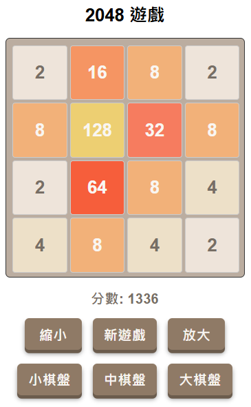

# 2048 Web Game



## 功能概述

*   網頁版 2048 遊戲，支援不同尺寸的棋盤 (3x3, 4x4, 5x5)
*   支援棋盤縮放功能 (放大/縮小)
*   使用 FastAPI 作為後端伺服器
*   使用 SQLite 儲存玩家資訊與遊戲記錄
*   完整記錄玩家遊戲數據，包括姓名、分數、遊戲時間、成功/失敗狀態和裝置信息
*   跨平台支援 (Windows, Android, iOS)
*   支援鍵盤與觸控操作

## 遊戲規則

*   遊戲可在 3x3、4x4 或 5x5 的方格中進行
*   每次操作可以選擇上下左右四個方向
*   所有方塊會朝選定的方向移動直到邊界或遇到另一個方塊
*   如果兩個相同數字的方塊在移動中碰撞，它們會合併成一個數字翻倍的新方塊
*   每次移動後，會在隨機的空格子中產生一個新的方塊 (2 或 4)
*   當方格填滿且無法進行有效移動時，遊戲結束
*   當出現 2048 的方塊時，玩家獲勝

## 遊戲特色

*   精美的視覺效果與動畫
*   互動性按鈕設計，提供觸覺反饋
*   響應式設計，自適應不同屏幕大小
*   統一的色彩主題，基於原版 2048 色系
*   遊戲難度可調整（通過改變棋盤大小）

## 操作方式

### 基本操作
*   桌面裝置：使用鍵盤上的上下左右方向鍵控制方塊移動
*   行動裝置：透過觸控滑動操作，向上、下、左、右滑動分別對應遊戲中相應移動方向
*   點擊「新遊戲」按鈕可重新開始遊戲

### 特殊功能
*   縮放功能：使用「放大」和「縮小」按鈕調整遊戲界面大小
*   棋盤大小：點擊「小棋盤」、「中棋盤」或「大棋盤」按鈕可更改遊戲難度

## 棋盤尺寸選項

*   小棋盤 (3x3)：
    - 每格更大，更容易看清
    - 難度較低，更容易達到 2048
    - 適合初學者或快速遊戲

*   中棋盤 (4x4)：
    - 標準 2048 遊戲尺寸
    - 中等難度
    - 經典遊戲體驗

*   大棋盤 (5x5)：
    - 更多格子，更多可能性
    - 難度較高，需要更高級的策略
    - 適合有經驗的玩家挑戰

## 資料庫記錄功能

遊戲會記錄以下詳細資訊：
*   玩家姓名（允許匿名，以 "none" 記錄）
*   遊戲日期時間（精確到毫秒）
*   最終分數
*   成功/失敗狀態（是否達到 2048）
*   玩家 IP 地址（用於統計）
*   瀏覽器/裝置資訊（User-Agent）
*   記錄創建時間

## 技術細節

### 後端架構

*   使用 Python 的 FastAPI 框架
*   SQLite 輕量級數據庫
*   非阻塞異步設計
*   API 端點：
    *   `/`: 遊戲首頁
    *   `/save_score`: 儲存玩家分數和遊戲資訊

### 前端技術

*   純 JavaScript，無外部依賴
*   CSS Grid 和 Flexbox 布局
*   響應式設計，適配桌面和移動裝置
*   觸控事件支援
*   動畫與視覺反饋

## 安裝與運行

### 系統需求

*   Python 3.7+
*   現代瀏覽器（支援 CSS Grid 和 ES6）

### 依賴包安裝

```bash
pip install fastapi uvicorn databases sqlalchemy aiosqlite jinja2 python-multipart
```

### 啟動伺服器

1.  克隆或下載此專案到本地
2.  在終端機中，切換到專案目錄
3.  執行 `python main.py` 啟動伺服器
4.  伺服器將在 `http://localhost:8000` 啟動
5.  使用瀏覽器訪問此地址即可開始遊戲

## 開發筆記

*   確保分數計算準確性，特別是在遊戲結束時
*   改進了模態框顯示機制，確保分數同步
*   棋盤縮放功能使用 CSS transform 實現，保持位置關係
*   優化了按鈕視覺效果，提供更好的用戶體驗